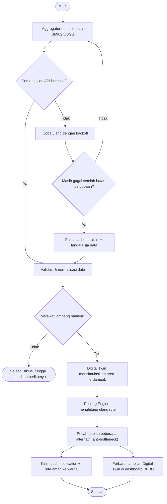
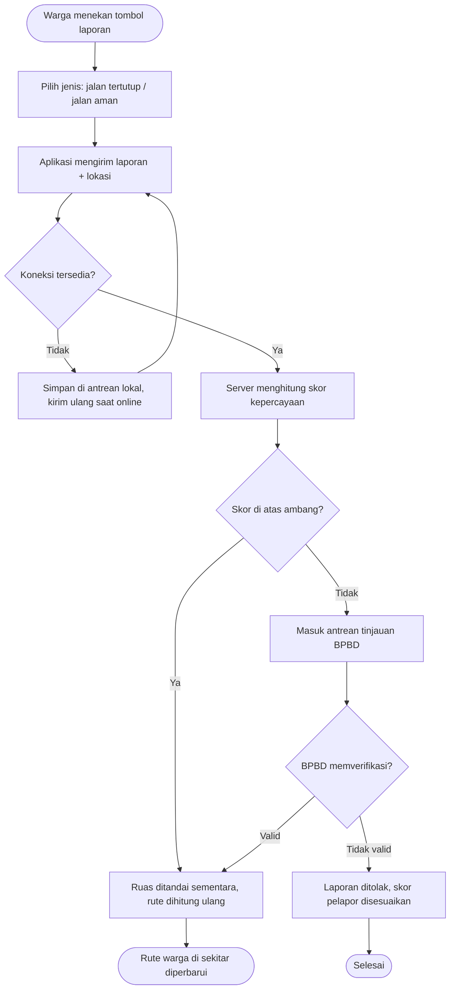
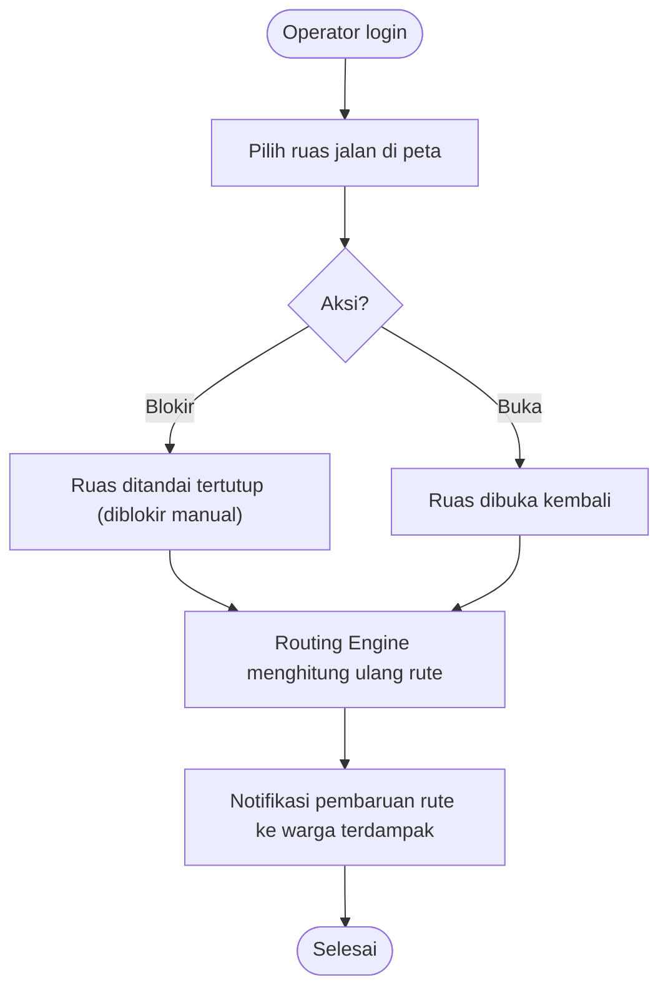

# 🔀 Activity Diagram

**HyperEvac System** · Rekayasa Perangkat Lunak · Universitas Samudra

> [!NOTE]
> Diagram aktivitas digambar dengan *flowchart* Mermaid (persegi = aktivitas, belah ketupat = keputusan).

## 1. Alur Utama: Dari Deteksi Bahaya sampai Warga Menerima Rute

## 2. Alur Laporan Warga (SOS) dan Verifikasi

## 3. Alur Pemblokiran Rute Manual oleh BPBD

