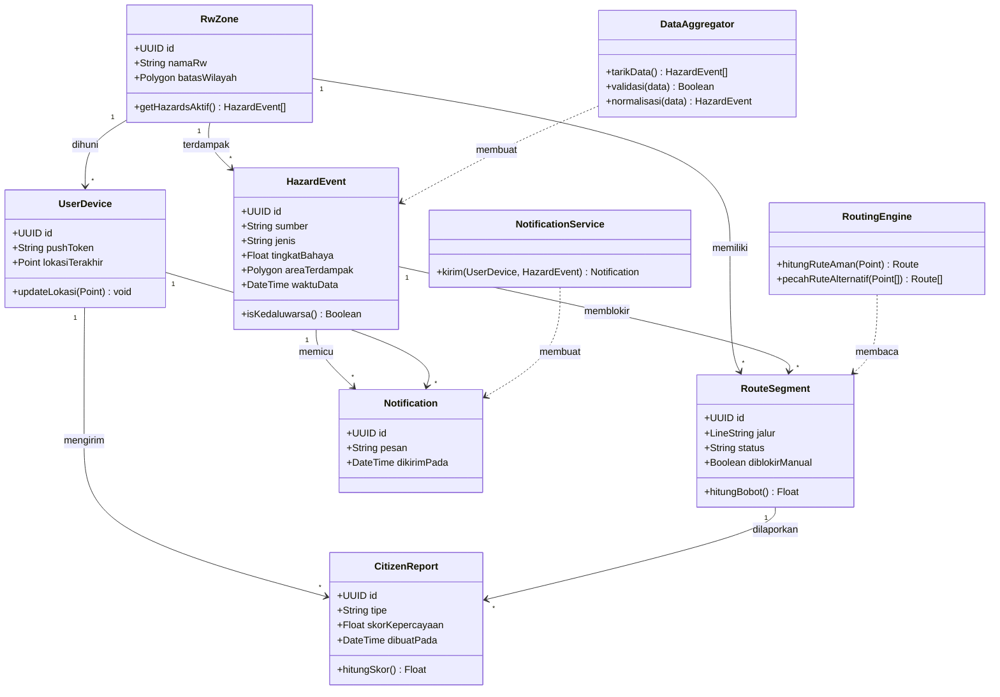

<div align="center">


# 🧱 Class Diagram & Skema Database

**HyperEvac System** · Rekayasa Perangkat Lunak · Universitas Samudra

</div>


> [!NOTE]
> Versi rinci dari ERD ringkas di [`docs/PROPOSAL.md`](../docs/PROPOSAL.md). Ini rancangan awal untuk Siklus 1 dan dapat berubah pada siklus evaluasi berikutnya.

## 1. Class Diagram



## 2. Skema Database (PostgreSQL + PostGIS)

```sql
CREATE EXTENSION IF NOT EXISTS postgis;
CREATE EXTENSION IF NOT EXISTS pgcrypto;  -- untuk gen_random_uuid()

CREATE TABLE rw_zone (
    id             UUID PRIMARY KEY DEFAULT gen_random_uuid(),
    nama_rw        TEXT NOT NULL,
    batas_wilayah  GEOMETRY(Polygon, 4326) NOT NULL
);

CREATE TABLE hazard_event (
    id              UUID PRIMARY KEY DEFAULT gen_random_uuid(),
    rw_id           UUID REFERENCES rw_zone(id) ON DELETE SET NULL,
    sumber          TEXT NOT NULL CHECK (sumber IN ('BMKG', 'USGS')),
    jenis           TEXT NOT NULL CHECK (jenis IN ('banjir', 'gempa', 'longsor', 'cuaca_ekstrem')),
    tingkat_bahaya  NUMERIC(4,2) NOT NULL,
    area_terdampak  GEOMETRY(Polygon, 4326),
    waktu_data      TIMESTAMPTZ NOT NULL,
    terverifikasi   BOOLEAN NOT NULL DEFAULT FALSE,
    dibuat_pada     TIMESTAMPTZ NOT NULL DEFAULT now()
);

CREATE TABLE route_segment (
    id                UUID PRIMARY KEY DEFAULT gen_random_uuid(),
    rw_id             UUID REFERENCES rw_zone(id) ON DELETE CASCADE,
    hazard_event_id   UUID REFERENCES hazard_event(id) ON DELETE SET NULL,
    jalur             GEOMETRY(LineString, 4326) NOT NULL,
    status            TEXT NOT NULL DEFAULT 'aman' CHECK (status IN ('aman', 'berisiko', 'tertutup')),
    diblokir_manual   BOOLEAN NOT NULL DEFAULT FALSE
);

CREATE TABLE user_device (
    id                UUID PRIMARY KEY DEFAULT gen_random_uuid(),
    rw_id             UUID REFERENCES rw_zone(id) ON DELETE SET NULL,
    push_token        TEXT NOT NULL UNIQUE,
    lokasi_terakhir   GEOMETRY(Point, 4326),
    diperbarui_pada   TIMESTAMPTZ NOT NULL DEFAULT now()
);

CREATE TABLE citizen_report (
    id                UUID PRIMARY KEY DEFAULT gen_random_uuid(),
    device_id         UUID NOT NULL REFERENCES user_device(id) ON DELETE CASCADE,
    segment_id        UUID REFERENCES route_segment(id) ON DELETE SET NULL,
    tipe              TEXT NOT NULL CHECK (tipe IN ('tertutup', 'aman')),
    skor_kepercayaan  NUMERIC(3,2) NOT NULL DEFAULT 0.50 CHECK (skor_kepercayaan BETWEEN 0 AND 1),
    dibuat_pada       TIMESTAMPTZ NOT NULL DEFAULT now()
);

CREATE TABLE notification (
    id              UUID PRIMARY KEY DEFAULT gen_random_uuid(),
    device_id       UUID NOT NULL REFERENCES user_device(id) ON DELETE CASCADE,
    hazard_id       UUID REFERENCES hazard_event(id) ON DELETE SET NULL,
    pesan           TEXT NOT NULL,
    dikirim_pada    TIMESTAMPTZ NOT NULL DEFAULT now()
);

-- Indeks spasial dan indeks yang sering dipakai
CREATE INDEX idx_rw_zone_batas        ON rw_zone        USING GIST (batas_wilayah);
CREATE INDEX idx_hazard_area          ON hazard_event   USING GIST (area_terdampak);
CREATE INDEX idx_hazard_waktu         ON hazard_event   (waktu_data DESC);
CREATE INDEX idx_route_jalur          ON route_segment  USING GIST (jalur);
CREATE INDEX idx_device_lokasi        ON user_device    USING GIST (lokasi_terakhir);
CREATE INDEX idx_report_segment       ON citizen_report (segment_id, dibuat_pada DESC);
```

### Catatan Perancangan

| Keputusan | Alasan |
|---|---|
| SRID 4326 (WGS 84) | Sama dengan koordinat GPS dan format API BMKG/USGS |
| Indeks GiST pada semua kolom geometri | Query "warga mana di dalam zona bahaya" dan "ruas mana yang terkena" harus cepat saat trafik puncak |
| `skor_kepercayaan` pada laporan | Mitigasi risiko R4 (laporan palsu) di proposal |
| `terverifikasi` pada `hazard_event` | Mendukung use case verifikasi data oleh BPBD (UC-04) |
| `hazard_event.rw_id` boleh NULL | Peristiwa seperti gempa dapat mencakup lebih dari satu RW |
