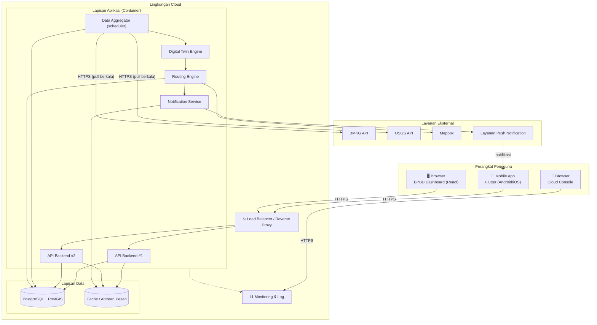

# ☁️ Deployment Diagram

**HyperEvac System** · Rekayasa Perangkat Lunak · Universitas Samudra

> [!NOTE]
> Rancangan penempatan komponen pada lingkungan cloud. Pemilihan penyedia cloud belum ditetapkan; dokumen ini hanya menentukan peran tiap komponen.

## 1. Diagram

## 2. Peran Komponen

| Komponen | Peran | Catatan |
|---|---|---|
| Load Balancer | Membagi trafik ke beberapa instance API, mengakhiri HTTPS | Mitigasi risiko R3 (server overload) |
| API Backend (≥ 2 instance) | Melayani permintaan mobile dan dashboard | Stateless agar mudah di-*scale* horizontal |
| Data Aggregator | Menarik data BMKG/USGS secara terjadwal, validasi, normalisasi | Menyimpan cache terakhir untuk *fallback* (R1) |
| Digital Twin Engine | Mensimulasikan area genangan dari data masuk | Diuji pada Siklus 2 |
| Routing Engine | Menghitung rute aman dan rute alternatif | Memakai Mapbox dan data ruas jalan di PostGIS |
| Notification Service | Menyusun dan mengirim push notification | Antrean pesan untuk pengiriman ulang (R5) |
| PostgreSQL + PostGIS | Penyimpanan data spasial dan transaksional | Lihat [skema database](CLASS-DAN-DATABASE.md) |
| Cache / Antrean | Menyimpan hasil sementara dan antrean notifikasi | Pilihan teknologi ditentukan saat Siklus 1 |
| Monitoring & Log | Uptime, trafik, error, log | Dipakai Tim Maintainer (UC-07) |

## 3. Lingkungan

| Lingkungan | Tujuan | Konfigurasi | Estimasi Biaya (dari proposal) |
|---|---|---|---|
| **Lokal (dev)** | Pengembangan harian | Docker Compose: PostgreSQL + PostGIS, aggregator | Rp 0 |
| **Testing** | Uji tiap siklus Spiral | Cloud *free tier*, 1 instance API | Rp 0 |
| **Produksi (skala kecil)** | Beta testing area terbatas | ≥ 2 instance API + load balancer | ± Rp 100.000 / bulan |

> [!TIP]
> Seluruh komponen dikemas dalam *container* agar lingkungan lokal, testing, dan produksi konsisten. Konfigurasi rahasia (API key, kredensial DB) hanya lewat variabel lingkungan, tidak di-*commit* ke repository.
