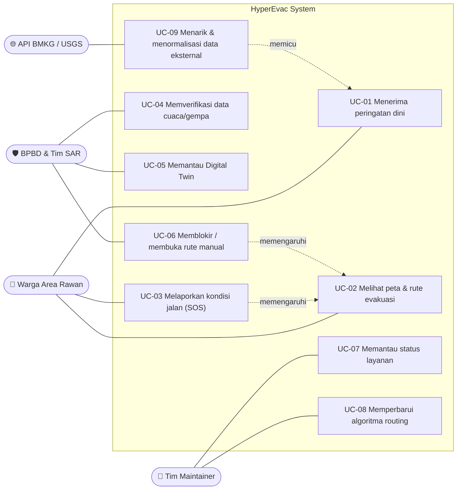

# 🎭 Use Case Diagram & Deskripsi

**HyperEvac System** · Rekayasa Perangkat Lunak · Universitas Samudra

> [!NOTE]
> Mermaid tidak memiliki tipe diagram use case bawaan, sehingga diagram di bawah digambar dengan *flowchart*: aktor di sisi luar, use case di dalam batas sistem. Kode `FR-xx` merujuk ke tabel kebutuhan fungsional di [`docs/PROPOSAL.md`](../docs/PROPOSAL.md).

## 1. Diagram

## 2. Deskripsi Use Case

| ID | Nama | Aktor | Prakondisi | Alur Utama | Pascakondisi | FR |
|---|---|---|---|---|---|---|
| UC-01 | Menerima peringatan dini | Warga | Aplikasi terpasang, izin notifikasi & lokasi aktif | 1. Sistem mendeteksi bahaya di zona warga. 2. Sistem mengirim push notification. 3. Warga membuka notifikasi. | Warga mengetahui bahaya di area RW-nya | FR-03 |
| UC-02 | Melihat peta & rute evakuasi | Warga | Ada zona bahaya aktif | 1. Warga membuka peta. 2. Sistem menampilkan zona bahaya. 3. Sistem menampilkan rute teraman dari lokasi warga. | Warga memiliki rute evakuasi terkini | FR-04, FR-05, FR-09 |
| UC-03 | Melaporkan kondisi jalan (SOS) | Warga | Aplikasi terpasang, lokasi aktif | 1. Warga menekan tombol SOS/laporan. 2. Warga memilih "tertutup" atau "aman". 3. Sistem menyimpan laporan dengan skor kepercayaan. | Laporan tersimpan dan dapat memengaruhi rute | FR-06 |
| UC-04 | Memverifikasi data cuaca/gempa | BPBD | Login sebagai operator | 1. Operator membuka daftar data masuk. 2. Operator meninjau dan menandai valid/tidak valid. | Data terverifikasi dipakai untuk simulasi | FR-07 |
| UC-05 | Memantau Digital Twin | BPBD | Login sebagai operator | 1. Operator membuka dashboard. 2. Sistem menampilkan zona bahaya dan sebaran warga. | Operator memiliki gambaran situasi terkini | FR-08 |
| UC-06 | Memblokir / membuka rute manual | BPBD | Login sebagai operator | 1. Operator memilih ruas jalan. 2. Operator memblokir atau membuka ruas. 3. Sistem menghitung ulang rute. | Rute warga diperbarui | FR-07 |
| UC-07 | Memantau status layanan | Maintainer | Akses cloud console | 1. Maintainer membuka console. 2. Sistem menampilkan uptime, trafik, dan log. | Kondisi layanan terpantau | FR-10 |
| UC-08 | Memperbarui algoritma routing | Maintainer | Akses repository & pipeline | 1. Maintainer memperbarui algoritma. 2. Diuji pada lingkungan uji. 3. Dirilis pada siklus berikutnya. | Versi routing baru berjalan | FR-05 |
| UC-09 | Menarik & menormalisasi data eksternal | API BMKG/USGS | Layanan aggregator berjalan | 1. Aggregator menarik data periodik. 2. Data divalidasi dan dinormalisasi. 3. Data disimpan. | Data siap dipakai simulasi | FR-01, FR-02 |

## 3. Alur Alternatif Penting

| Use Case | Kondisi | Penanganan |
|---|---|---|
| UC-09 | API publik *timeout* / *down* | Coba ulang dengan *backoff*; jika tetap gagal, pakai data cache terakhir dan beri penanda usia data |
| UC-02 | Jaringan warga terputus | Tampilkan rute terakhir yang tersimpan di perangkat (*offline-first*) |
| UC-03 | Laporan berlawanan dari beberapa warga | Turunkan skor kepercayaan, tandai untuk ditinjau BPBD |
