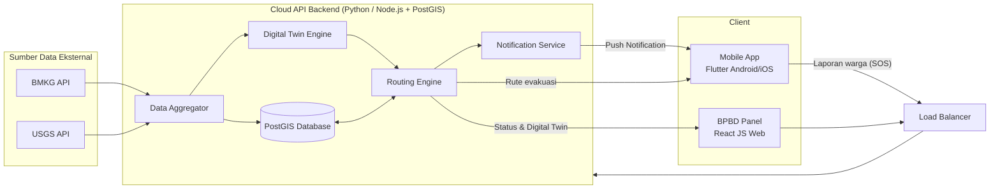
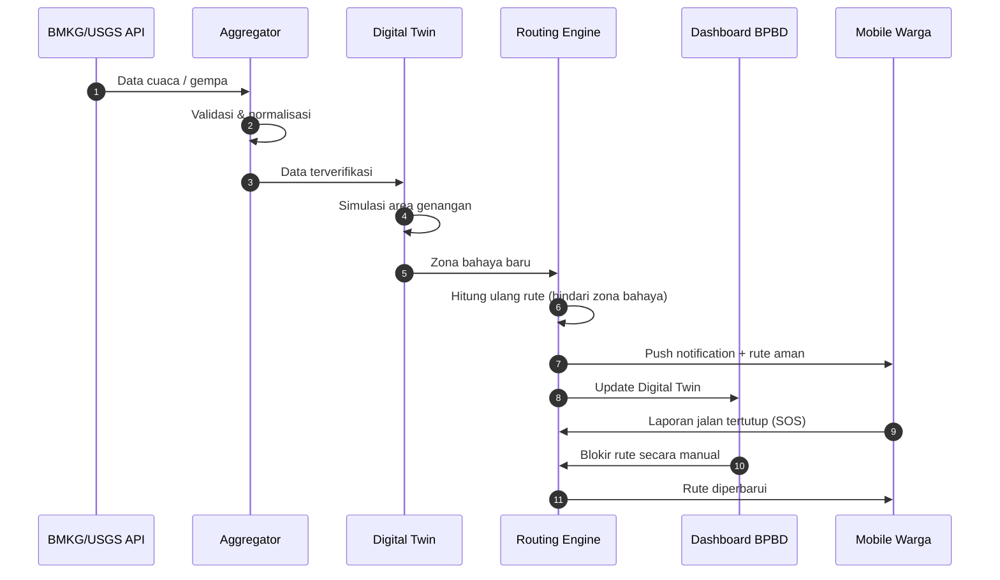
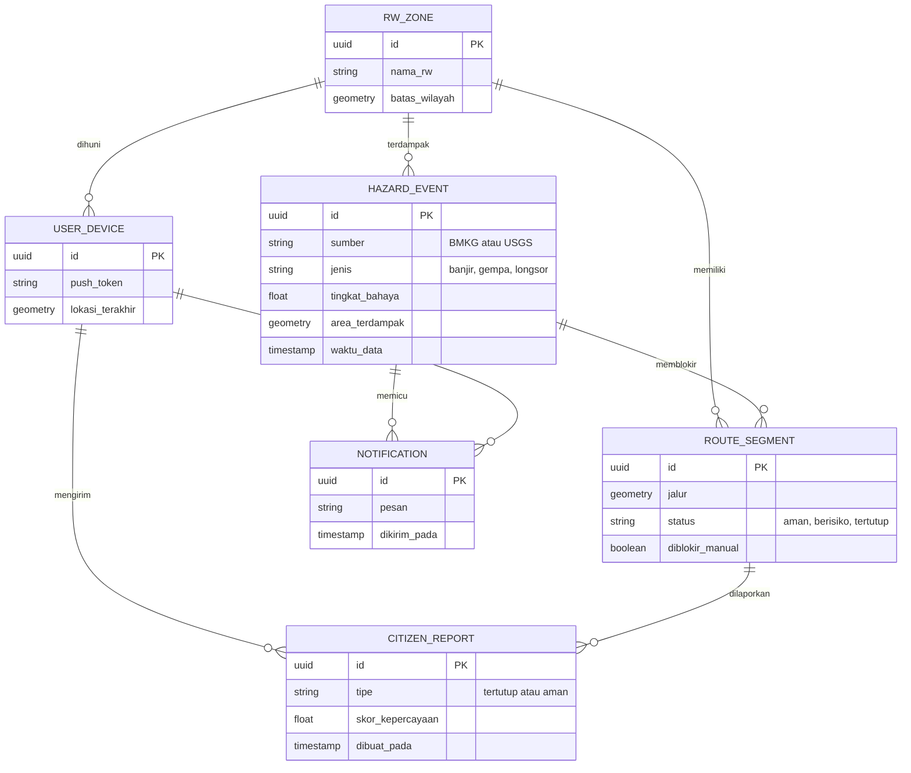
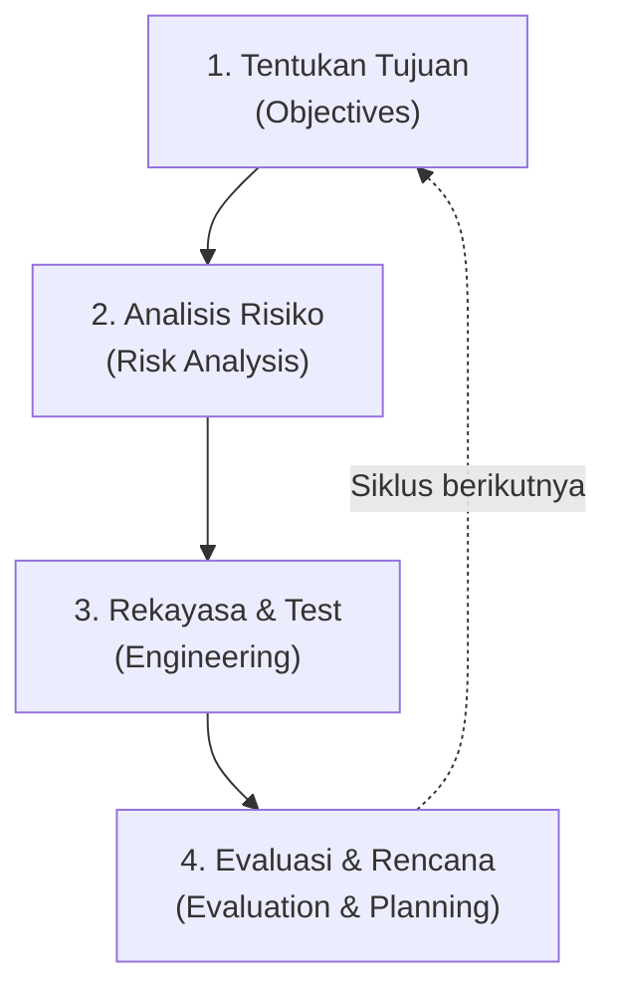
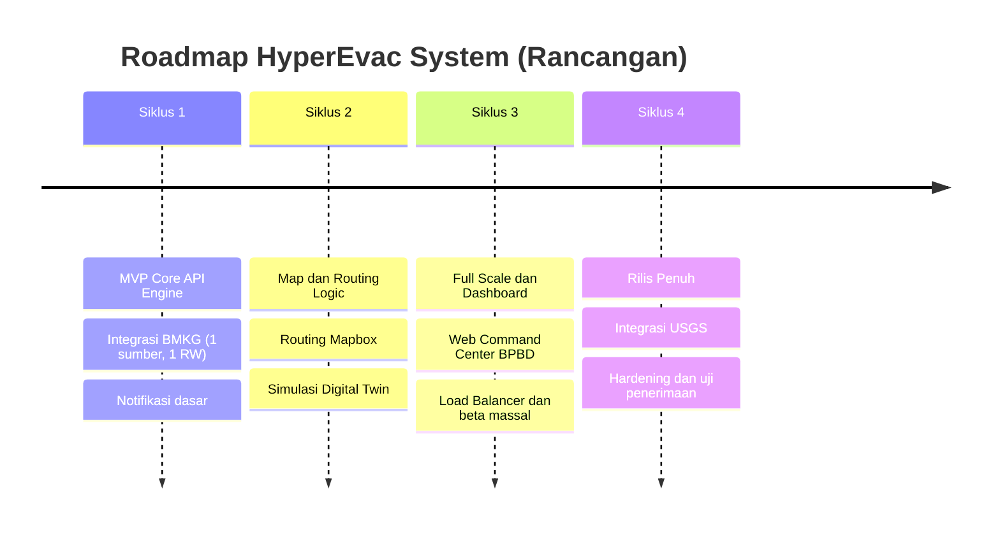

<div align="center">


<br/>


### `> Pengembangan Sistem Informasi Peringatan Dini dan Navigasi Evakuasi Bencana Hyper-Lokal`
**Berbasis Real-Time Data Aggregation · Menggunakan Model Spiral**

</div>


## 📡 Daftar Isi

1. [Ringkasan Proyek](#-ringkasan-proyek)
2. [Latar Belakang & Permasalahan](#-latar-belakang--permasalahan)
3. [Tujuan & Ruang Lingkup](#-tujuan--ruang-lingkup)
4. [Klasifikasi & Karakteristik Perangkat Lunak](#-klasifikasi--karakteristik-perangkat-lunak)
5. [Stakeholder Ekosistem](#-stakeholder-ekosistem)
6. [Kebutuhan Sistem](#-kebutuhan-sistem)
7. [Arsitektur Sistem](#-arsitektur-sistem)
8. [Model Data & Kontrak API](#-model-data--kontrak-api)
9. [Pemodelan Proses SDLC: Model Spiral](#-pemodelan-proses-sdlc-model-spiral)
10. [Siklus Iterasi Pengembangan](#-siklus-iterasi-pengembangan)
11. [Inovasi: Predictive Digital Twin Engine](#-inovasi-predictive-digital-twin-engine)
12. [Analisis Risiko](#-analisis-risiko)
13. [Kelebihan, Kelemahan & Strategi Mitigasi](#-kelebihan-kelemahan--strategi-mitigasi)
14. [Strategi Pengujian](#-strategi-pengujian)
15. [Rencana Anggaran & Kelayakan](#-rencana-anggaran--kelayakan)
16. [Roadmap](#-roadmap)
17. [Struktur Repository](#-struktur-repository)
18. [Tim Pengembang](#-tim-pengembang)
19. [Kesimpulan](#-kesimpulan)
20. [Daftar Pustaka](#-daftar-pustaka)


## 🛰️ Ringkasan Proyek

**HyperEvac System** adalah sistem informasi berbasis perangkat lunak murni (*software-only*) yang memberikan **peringatan dini otomatis** dan **navigasi rute evakuasi teraman** hingga ke tingkat **jalan/RW** saat bencana terjadi. Sistem menarik data cuaca dan gempa dari API publik (BMKG/USGS) secara *real-time*, mensimulasikan area terdampak melalui **Predictive Digital Twin Engine**, lalu menghitung ulang rute evakuasi secara dinamis di peta mobile warga.

> [!IMPORTANT]
> Dokumen ini adalah **proposal proyek** untuk Tugas Analisis Rekayasa Perangkat Lunak. Seluruh komponen pada bagian arsitektur, kebutuhan, dan roadmap merupakan rancangan, bukan implementasi yang sudah berjalan.

| Atribut | Keterangan |
|---|---|
| **Nama Sistem** | HyperEvac System |
| **Kategori** | Real-Time Data Aggregator & Cloud GIS System |
| **Platform** | Mobile App (Android/iOS), Web Dashboard, API Service |
| **Karakter** | Critical-Safety (*high availability*, tahan *server overload*) |
| **Metode SDLC** | Model Spiral (*risk-driven approach*) |
| **Pendekatan** | Software-Only, tanpa sensor/hardware fisik |


## 🚨 Latar Belakang & Permasalahan

Mengapa pendekatan konvensional gagal, dan mengapa solusi berbasis software mendesak untuk dibangun.

| ❌ Permasalahan Eksisting | ✅ Solusi HyperEvac |
|---|---|
| **Informasi terlambat & berskala makro.** Peringatan pemerintah sering berskala kabupaten, tidak spesifik hingga tingkat jalan/RW. | **Software-Only Approach.** Menggantikan sensor fisik dengan tarikan data API publik (BMKG/USGS) secara *real-time*. |
| **Rute evakuasi statis.** Peta fisik tidak bisa mendeteksi jalan yang tiba-tiba terputus akibat luapan air atau longsor. | **Dynamic Routing API.** Menghitung ulang rute secara otomatis di peta mobile jika zona bahaya terdeteksi. |
| **Biaya hardware mahal.** Sensor banjir fisik rawan rusak, dicuri, atau hancur tersapu arus. | **Crowdsourcing Data.** Warga saling melaporkan rute aman atau tertutup langsung dari aplikasi. |


## 🎯 Tujuan & Ruang Lingkup

### Tujuan

1. Memberikan **notifikasi dini otomatis** yang spesifik ke lokasi warga (level RW).
2. Memandu **navigasi rute evakuasi teraman** yang beradaptasi terhadap kondisi bahaya terkini.
3. Menyediakan **pusat kendali** bagi BPBD & Tim SAR untuk memantau, memverifikasi, dan memblokir rute berbahaya.
4. Menjamin **keandalan** layanan pada kondisi lonjakan trafik saat krisis.

### Ruang Lingkup

| ✅ Termasuk (In Scope) | 🚫 Tidak Termasuk (Out of Scope) |
|---|---|
| Agregasi data API BMKG & USGS | Pengadaan sensor / IoT fisik |
| Push notification berbasis lokasi | Sistem sirene / alat peringatan fisik |
| Routing evakuasi dinamis (Mapbox) | Peta 3D fotorealistis skala kota |
| Laporan warga (crowdsourcing) via tombol SOS | Integrasi sistem internal instansi di luar API terbuka |
| Web dashboard BPBD & Tim SAR | Penanganan logistik pascabencana |
| Cloud console & load balancing | Prediksi bencana berbasis machine learning penuh |

> [!NOTE]
> Pada **Siklus 1 (MVP)**, cakupan dikunci secara ekstrem: **1 sumber data (API BMKG) + 1 wilayah terbatas (level RW)**.


## 🧬 Klasifikasi & Karakteristik Perangkat Lunak

| | Tujuan Software | Jenis Software | Karakteristik Utama |
|---|---|---|---|
| **Deskripsi** | Notifikasi dini otomatis dan pemanduan rute evakuasi teraman ke lokasi spesifik warga saat krisis. | **Real-Time Data Aggregator & Cloud GIS System.** Ekosistem murni berbasis perangkat lunak (Mobile App, Web, dan API Service). | Kategori **Critical-Safety**. Membutuhkan *high availability* dan perlindungan dari *server overload*. |

> [!TIP]
> **Implikasi RPL:** karena karakter *critical-safety*, metode SDLC yang dipilih haruslah model yang menjadikan **Analisis Risiko** sebagai prioritas utama.


## 👥 Stakeholder Ekosistem

Peta interaksi multi-pengguna terhadap komponen perangkat lunak (*Multi-App System*).

| Stakeholder | Peran | Aplikasi | Interaksi Utama |
|---|---|---|---|
| **Warga Area Rawan** | End-user / Client | 📱 Mobile App | Menerima *push notification* saat darurat · Melihat peta rute evakuasi interaktif · Melaporkan jalan tertutup via tombol SOS |
| **BPBD & Tim SAR** 🛡️ *Pusat Kendali* | Operator & Decision Maker | 🖥️ Web Dashboard | Memantau pergerakan warga (Digital Twin) · Memverifikasi data cuaca/gempa · Memblokir rute berbahaya secara manual |
| **Tim Maintainer** | System Administrator | ☁️ Cloud Console | Menjaga *uptime* API Integrator · Mengelola *Load Balancer* saat trafik memuncak · Pembaruan iteratif algoritma *routing* |


## 📋 Kebutuhan Sistem

> [!NOTE]
> Bagian ini adalah penjabaran tambahan dari materi analisis untuk melengkapi proposal. Angka pada kebutuhan non-fungsional adalah **target rancangan** yang akan divalidasi pada tiap siklus Spiral.

### Kebutuhan Fungsional

| ID | Kebutuhan | Aplikasi | Prioritas |
|---|---|---|---|
| FR-01 | Sistem menarik data cuaca/gempa dari API BMKG & USGS secara periodik | API Backend | Tinggi |
| FR-02 | Sistem menormalisasi dan memvalidasi data yang masuk sebelum dipakai | API Backend | Tinggi |
| FR-03 | Sistem mengirim *push notification* ke warga pada zona terdampak | Mobile | Tinggi |
| FR-04 | Warga dapat melihat peta zona bahaya dan rute evakuasi interaktif | Mobile | Tinggi |
| FR-05 | Rute dihitung ulang otomatis saat zona bahaya baru terdeteksi | Routing Engine | Tinggi |
| FR-06 | Warga dapat melaporkan jalan tertutup/aman melalui tombol SOS | Mobile | Sedang |
| FR-07 | BPBD dapat memverifikasi data dan memblokir/membuka rute secara manual | Web Dashboard | Tinggi |
| FR-08 | Dashboard menampilkan Digital Twin wilayah dan sebaran warga | Web Dashboard | Sedang |
| FR-09 | Sistem memecah arahan evakuasi ke beberapa rute alternatif (anti-*bottleneck*) | Routing Engine | Sedang |
| FR-10 | Tim Maintainer dapat memantau status layanan, trafik, dan log | Cloud Console | Sedang |

### Kebutuhan Non-Fungsional (Target)

| ID | Kategori | Target Rancangan |
|---|---|---|
| NFR-01 | **Availability** | Layanan inti (notifikasi & routing) ≥ 99,5% pada masa produksi |
| NFR-02 | **Latensi** | Respons API routing di bawah 500 ms pada beban normal |
| NFR-03 | **Skalabilitas** | Mendukung lonjakan trafik melalui *load balancer* dan *horizontal scaling* |
| NFR-04 | **Ketahanan** | Ada *fallback* saat API publik *down/timeout* (cache data terakhir + penanda usia data) |
| NFR-05 | **Keamanan** | Autentikasi berbasis token, RBAC untuk dashboard, enkripsi HTTPS |
| NFR-06 | **Privasi** | Data lokasi warga diminimalkan, dianonimkan untuk analitik |
| NFR-07 | **Usability** | Antarmuka mobile sederhana, dapat dipakai dalam kondisi panik |
| NFR-08 | **Keandalan data** | Laporan crowdsourcing diberi skor kepercayaan sebelum memengaruhi rute |


## 🏗️ Arsitektur Sistem

Tech stack berbasis cloud dengan pendekatan **microservices**, tanpa perangkat keras fisik.



### Tech Stack

| Lapisan | Teknologi |
|---|---|
| **Mobile** | Flutter (Android/iOS) |
| **Web Dashboard** | React JS |
| **Backend** | Python / Node.js |
| **Database Spasial** | PostgreSQL + PostGIS |
| **Peta & Routing** | Mapbox |
| **Sumber Data** | API terbuka BMKG & USGS |
| **Infrastruktur** | Cloud (free tier untuk testing), Load Balancer, kontainerisasi Docker |

### Alur Kerja Peringatan dan Rerouting




## 🗄️ Model Data & Kontrak API

> [!NOTE]
> Rancangan awal untuk memandu Siklus 1. Skema dan endpoint dapat berubah pada siklus evaluasi berikutnya.

### Model Data (ERD Ringkas)



### Rancangan Endpoint API

| Method | Endpoint | Fungsi |
|---|---|---|
| `GET` | `/v1/hazards?rw={id}` | Daftar bahaya aktif pada suatu RW |
| `GET` | `/v1/routes/evacuation?lat=&lng=` | Rute evakuasi teraman dari titik warga |
| `POST` | `/v1/reports` | Kirim laporan jalan tertutup/aman (SOS) |
| `POST` | `/v1/admin/routes/block` | Blokir rute secara manual (BPBD) |
| `DELETE` | `/v1/admin/routes/block/{id}` | Buka kembali rute yang diblokir |
| `GET` | `/v1/twin/{rw_id}` | Status Digital Twin suatu RW |
| `GET` | `/v1/health` | Status layanan untuk *monitoring* |


## 🌀 Pemodelan Proses SDLC: Model Spiral

**Pemilihan metode berbasis risiko (*Risk-Driven Approach*) untuk sistem keselamatan kritis.**

### Argumen Utama

Aplikasi kebencanaan **tidak boleh gagal saat kondisi darurat**. Model Spiral mewajibkan **Risk Assessment (Analisis Risiko)** di setiap siklus perulangan **sebelum** pengerjaan kode dilakukan.

| Alasan | Penjelasan |
|---|---|
| **Sifat iteratif (bertahap)** | Menggabungkan pembuatan prototipe berulang agar fitur bisa dirilis dan diuji sedikit demi sedikit. |
| **Evaluasi server berkelanjutan** | Setiap siklus menghasilkan prototipe yang langsung diuji beban (*load testing*) untuk menjamin latensi rendah. |
| **Risiko sebagai penentu** | Keputusan teknis tiap siklus ditentukan oleh hasil analisis risiko, bukan sekadar daftar fitur. |

### Empat Kuadran Spiral




## 🔁 Siklus Iterasi Pengembangan

Penerapan praktis empat tahapan Spiral dari **Minimum Viable Product (MVP)** hingga rilis penuh.

| Siklus | Fokus | 1. Tujuan | 2. Risiko | 3. Rekayasa | 4. Evaluasi |
|---|---|---|---|---|---|
| **S1**<br/>🟢 MVP Core | API Engine | Integrasi API BMKG & USGS | API publik down/timeout | Script Python Aggregator | Uji notifikasi dasar 1 area |
| **S2**<br/>🟡 Map & Routing | Routing Logic | Algoritma rute via Mapbox | Penumpukan rute warga | Simulasi Digital Twin rute | Akurasi rute menghindari genangan |
| **S3**<br/>🟠 Full Scale | Dashboard | Web Command Center BPBD | Server overload (trafik puncak) | Set Load Balancer & Cloud | Beta testing massal area luas |
| **S4**<br/>🔴 Rilis Penuh* | Hardening | Rilis produksi & operasional | Regresi & kegagalan integrasi | Perbaikan, optimasi, dokumentasi | Uji penerimaan bersama BPBD |

<sub>*Siklus 4 adalah tambahan dalam proposal ini agar empat tahapan Spiral hingga rilis penuh tercakup; materi analisis merinci tiga siklus awal.</sub>


## ✨ Inovasi: Predictive Digital Twin Engine

Simulasi spasial *real-time* **tanpa memerlukan pengadaan hardware sensor fisik**.

### 🗺️ Dynamic Hazard Mapping

Membuat visualisasi kembaran digital 2D/3D dari suatu wilayah. Saat API melaporkan curah hujan tinggi, sistem otomatis mensimulasikan **area cakupan genangan luapan air** di atas peta.

### 🚦 Traffic Bottleneck Avoidance

Memodelkan kepanikan massa. Sistem memecah pergerakan warga ke **beberapa rute alternatif secara simultan** agar tidak terjadi kemacetan fatal di satu jalan kecil (*bottleneck*).

### Contoh Output Konsol Digital Twin

```text
● LIVE DIGITAL TWIN                              ZONE: RW 05 - HYPERLOCAL
──────────────────────────────────────────────────────────────────────────
[SIMULATION ENGINE]: Fetching BMKG Flood Data...
[HAZARD DETECTED]:   Water Level +45cm at Point B
[REROUTING ACTIVE]:  Blocking Route #02 (Bridge A)
[SAFE PATH GENERATED]: Route #05 via Hillside Rd
──────────────────────────────────────────────────────────────────────────
Latency: 120ms                                        Active Users: 1,420
```


## ⚠️ Analisis Risiko

Ringkasan risiko utama sebagai dasar tiap siklus Spiral. Penilaian probabilitas/dampak adalah estimasi awal tim.

| # | Risiko | Siklus | Probabilitas | Dampak | Strategi Mitigasi |
|---|---|---|---|---|---|
| R1 | API publik (BMKG/USGS) *down* atau *timeout* | S1 | Sedang | Tinggi | Cache data terakhir, *retry* dengan *backoff*, penanda usia data di aplikasi |
| R2 | Penumpukan warga di satu rute | S2 | Sedang | Tinggi | Pemecahan rute alternatif simultan, simulasi Digital Twin |
| R3 | Server *overload* saat trafik puncak | S3 | Tinggi | Tinggi | Load balancer, *autoscaling*, *load testing* di setiap siklus |
| R4 | Laporan warga palsu/keliru | S2–S3 | Sedang | Sedang | Skor kepercayaan, verifikasi silang, moderasi BPBD |
| R5 | Notifikasi terlambat atau tidak terkirim | S1–S3 | Sedang | Tinggi | Antrean pesan, pengiriman berulang, kanal cadangan |
| R6 | Jaringan seluler warga terputus saat bencana | S2–S4 | Tinggi | Tinggi | Cache peta & rute terakhir di perangkat (offline-first) |
| R7 | Waktu pengembangan melebihi rencana | Semua | Tinggi | Sedang | MVP ekstrem, batasi cakupan tiap siklus |


## ⚖️ Kelebihan, Kelemahan & Strategi Mitigasi

### 🟢 Kelebihan Penerapan Spiral

- **Jaminan keamanan tingkat tinggi:** mencegah rilis fitur yang berisiko membuat server *down* saat krisis.
- **Adaptif terhadap data baru:** sumber API tambahan mudah diintegrasikan pada siklus berikutnya tanpa merombak sistem awal.
- **Prototipe selalu stabil:** versi apa pun yang sedang *online* telah melewati pengujian ketat.

### 🔴 Kelemahan Model Spiral

- Waktu pengembangan memakan durasi yang sangat lama.
- Membutuhkan keahlian *Risk Assessment* level senior yang mahal.

### 🛡️ Strategi Mitigasi Kelompok

Menerapkan konsep **Minimum Viable Product (MVP) secara ekstrem**. Pada Siklus 1, batasan dikunci hanya pada:

> **1 Sumber Data (API BMKG) + 1 Wilayah Terbatas (Level RW)**


## 🧪 Strategi Pengujian

> [!NOTE]
> Bagian tambahan proposal untuk memperjelas bagaimana kuadran "Rekayasa & Test" dijalankan.

| Jenis Pengujian | Tujuan | Kapan |
|---|---|---|
| **Unit & Integration Test** | Memastikan logika aggregator, routing, dan API berjalan benar | Setiap siklus |
| **Fault-Injection Test** | Mensimulasikan API publik *down/timeout* untuk menguji *fallback* | S1 dan seterusnya |
| **Load / Stress Test** | Mengukur latensi dan batas kapasitas saat trafik puncak | S1 (ringan), S3 (penuh) |
| **Simulasi Rute (Digital Twin)** | Menguji akurasi rute menghindari genangan dan *bottleneck* | S2 |
| **Beta Testing Lapangan** | Uji dengan pengguna nyata pada area terbatas hingga luas | S1 (1 area), S3 (area luas) |
| **User Acceptance Test** | Validasi bersama BPBD/Tim SAR sebelum rilis | S4 |


## 💸 Rencana Anggaran & Kelayakan

Kalkulasi efisiensi tanpa perangkat keras (estimasi realistis, *software-only*).

| Komponen | Estimasi Biaya |
|---|---|
| Pembuatan makalah/analisis | **Rp 0** |
| Cloud server (tahap testing) | **Rp 0** (Free Tier) |
| Server skala kecil (produksi) | **± Rp 100.000 / bulan** |

> Sangat terjangkau untuk skala tugas mahasiswa karena menghilangkan kebutuhan pembelian sensor/komponen hardware fisik.


## 🗓️ Roadmap



- [ ] Finalisasi proposal & analisis risiko awal
- [ ] Siklus 1: Aggregator BMKG + notifikasi 1 RW
- [ ] Siklus 2: Routing dinamis + simulasi Digital Twin
- [ ] Siklus 3: Dashboard BPBD + load balancing + beta testing
- [ ] Siklus 4: Rilis produksi + uji penerimaan


## 📁 Struktur Repository

Rancangan struktur direktori yang akan dipakai saat implementasi.

```text
hyperevac-system/
├── assets/                 # Aset dokumentasi (banner, divider)
├── docs/                   # Dokumen analisis, diagram, laporan siklus
├── backend/
│   ├── aggregator/         # Penarik & normalisasi data BMKG/USGS
│   ├── routing-engine/     # Logika routing dinamis
│   ├── twin-engine/        # Simulasi Digital Twin
│   └── notification/       # Layanan push notification
├── mobile/                 # Aplikasi Flutter (warga)
├── dashboard/              # Web dashboard React (BPBD & Tim SAR)
├── infra/                  # Docker, konfigurasi load balancer, IaC
└── README.md
```


## 👨‍💻 Tim Pengembang

**Mata Kuliah:** Rekayasa Perangkat Lunak · **Program Studi:** Informatika · **Universitas Samudra**

| No | Nama | NIM |
|:-:|---|:-:|
| 1 | Raihan Noor | 240504148 |
| 2 | Muhammad Najwan Jabir A. | 240504151 |
| 3 | Deby Syahdan | 240504124 |
| 4 | M. Julian Saputra | 240504092 |


## 🏁 Kesimpulan

Pendekatan sistem murni *software-only* pada HyperEvac terbukti **realistis dan efisien secara biaya**. Pemilihan **Model Spiral** sangat krusial dan tepat sasaran untuk memitigasi kegagalan jaringan/server saat terjadi lonjakan pengguna di tengah bencana, sehingga menjamin sistem peringatan dini yang berorientasi pada **keselamatan nyawa**.

## 📚 Daftar Pustaka

1. Pressman, R. S., & Maxim, B. R. (2020). *Software Engineering: A Practitioner's Approach* (9th ed.). McGraw-Hill Education.
2. Sommerville, I. (2016). *Software Engineering* (10th ed.). Pearson Education.
3. Badan Meteorologi, Klimatologi, dan Geofisika (BMKG). (2024). *Dokumentasi API Terbuka Data Cuaca dan Gempa Bumi.* API Publik Pemerintah RI.

<br/>

<div align="center">

**Terima Kasih — Sesi Tanya Jawab**


</div>

