<div align="center">



<br/>


### `> Pengembangan Sistem Informasi Peringatan Dini dan Navigasi Evakuasi Bencana Hyper-Lokal`
**Berbasis Real-Time Data Aggregation · Menggunakan Model Spiral**

</div>


## 📡 Daftar Isi

1. [Ringkasan Proyek](#-ringkasan-proyek)
2. [Latar Belakang & Permasalahan](#-latar-belakang--permasalahan)
3. [Tujuan & Ruang Lingkup](#-tujuan--ruang-lingkup)
4. [Klasifikasi & Karakteristik Perangkat Lunak](#-klasifikasi--karakteristik-perangkat-lunak)
5. [Stakeholder Ekosistem](#-stakeholder-ekosistem)
6. [Kebutuhan Sistem](#-kebutuhan-sistem)
7. [Arsitektur Sistem](#-arsitektur-sistem)
8. [Model Data & Kontrak API](#-model-data--kontrak-api)
9. [Pemodelan Proses SDLC: Model Spiral](#-pemodelan-proses-sdlc-model-spiral)
10. [Siklus Iterasi Pengembangan](#-siklus-iterasi-pengembangan)
11. [Inovasi: Predictive Digital Twin Engine](#-inovasi-predictive-digital-twin-engine)
12. [Analisis Risiko](#-analisis-risiko)
13. [Kelebihan, Kelemahan & Strategi Mitigasi](#-kelebihan-kelemahan--strategi-mitigasi)
14. [Strategi Pengujian](#-strategi-pengujian)
15. [Rencana Anggaran & Kelayakan](#-rencana-anggaran--kelayakan)
16. [Roadmap](#-roadmap)
17. [Struktur Repository](#-struktur-repository)
18. [Tim Pengembang](#-tim-pengembang)
19. [Kesimpulan](#-kesimpulan)
20. [Daftar Pustaka](#-daftar-pustaka)


## 🛰️ Ringkasan Proyek

**HyperEvac System** adalah sistem informasi berbasis perangkat lunak murni (*software-only*) yang memberikan **peringatan dini otomatis** dan **navigasi rute evakuasi teraman** hingga ke tingkat **jalan/RW** saat bencana terjadi. Sistem menarik data cuaca dan gempa dari API publik (BMKG/USGS) secara *real-time*, mensimulasikan area terdampak melalui **Predictive Digital Twin Engine**, lalu menghitung ulang rute evakuasi secara dinamis di peta mobile warga.

> [!IMPORTANT]
> Dokumen ini adalah **proposal proyek** untuk Tugas Analisis Rekayasa Perangkat Lunak. Seluruh komponen pada bagian arsitektur, kebutuhan, dan roadmap merupakan rancangan, bukan implementasi yang sudah berjalan.

| Atribut | Keterangan |
|---|---|
| **Nama Sistem** | HyperEvac System |
| **Kategori** | Real-Time Data Aggregator & Cloud GIS System |
| **Platform** | Mobile App (Android/iOS), Web Dashboard, API Service |
| **Karakter** | Critical-Safety (*high availability*, tahan *server overload*) |
| **Metode SDLC** | Model Spiral (*risk-driven approach*) |
| **Pendekatan** | Software-Only, tanpa sensor/hardware fisik |


## 🚨 Latar Belakang & Permasalahan

Mengapa pendekatan konvensional gagal, dan mengapa solusi berbasis software mendesak untuk dibangun.

| ❌ Permasalahan Eksisting | ✅ Solusi HyperEvac |
|---|---|
| **Informasi terlambat & berskala makro.** Peringatan pemerintah sering berskala kabupaten, tidak spesifik hingga tingkat jalan/RW. | **Software-Only Approach.** Menggantikan sensor fisik dengan tarikan data API publik (BMKG/USGS) secara *real-time*. |
| **Rute evakuasi statis.** Peta fisik tidak bisa mendeteksi jalan yang tiba-tiba terputus akibat luapan air atau longsor. | **Dynamic Routing API.** Menghitung ulang rute secara otomatis di peta mobile jika zona bahaya terdeteksi. |
| **Biaya hardware mahal.** Sensor banjir fisik rawan rusak, dicuri, atau hancur tersapu arus. | **Crowdsourcing Data.** Warga saling melaporkan rute aman atau tertutup langsung dari aplikasi. |


## 🎯 Tujuan & Ruang Lingkup

### Tujuan

1. Memberikan **notifikasi dini otomatis** yang spesifik ke lokasi warga (level RW).
2. Memandu **navigasi rute evakuasi teraman** yang beradaptasi terhadap kondisi bahaya terkini.
3. Menyediakan **pusat kendali** bagi BPBD & Tim SAR untuk memantau, memverifikasi, dan memblokir rute berbahaya.
4. Menjamin **keandalan** layanan pada kondisi lonjakan trafik saat krisis.

### Ruang Lingkup

| ✅ Termasuk (In Scope) | 🚫 Tidak Termasuk (Out of Scope) |
|---|---|
| Agregasi data API BMKG & USGS | Pengadaan sensor / IoT fisik |
| Push notification berbasis lokasi | Sistem sirene / alat peringatan fisik |
| Routing evakuasi dinamis (Mapbox) | Peta 3D fotorealistis skala kota |
| Laporan warga (crowdsourcing) via tombol SOS | Integrasi sistem internal instansi di luar API terbuka |
| Web dashboard BPBD & Tim SAR | Penanganan logistik pascabencana |
| Cloud console & load balancing | Prediksi bencana berbasis machine learning penuh |

> [!NOTE]
> Pada **Siklus 1 (MVP)**, cakupan dikunci secara ekstrem: **1 sumber data (API BMKG) + 1 wilayah terbatas (level RW)**.


## 🧬 Klasifikasi & Karakteristik Perangkat Lunak

| | Tujuan Software | Jenis Software | Karakteristik Utama |
|---|---|---|---|
| **Deskripsi** | Notifikasi dini otomatis dan pemanduan rute evakuasi teraman ke lokasi spesifik warga saat krisis. | **Real-Time Data Aggregator & Cloud GIS System.** Ekosistem murni berbasis perangkat lunak (Mobile App, Web, dan API Service). | Kategori **Critical-Safety**. Membutuhkan *high availability* dan perlindungan dari *server overload*. |

> [!TIP]
> **Implikasi RPL:** karena karakter *critical-safety*, metode SDLC yang dipilih haruslah model yang menjadikan **Analisis Risiko** sebagai prioritas utama.


## 👥 Stakeholder Ekosistem

Peta interaksi multi-pengguna terhadap komponen perangkat lunak (*Multi-App System*).

| Stakeholder | Peran | Aplikasi | Interaksi Utama |
|---|---|---|---|
| **Warga Area Rawan** | End-user / Client | 📱 Mobile App | Menerima *push notification* saat darurat · Melihat peta rute evakuasi interaktif · Melaporkan jalan tertutup via tombol SOS |
| **BPBD & Tim SAR** 🛡️ *Pusat Kendali* | Operator & Decision Maker | 🖥️ Web Dashboard | Memantau pergerakan warga (Digital Twin) · Memverifikasi data cuaca/gempa · Memblokir rute berbahaya secara manual |
| **Tim Maintainer** | System Administrator | ☁️ Cloud Console | Menjaga *uptime* API Integrator · Mengelola *Load Balancer* saat trafik memuncak · Pembaruan iteratif algoritma *routing* |


## 📋 Kebutuhan Sistem

> [!NOTE]
> Rincian lengkap dokumen Use Case dan Activity Diagram dapat diakses di folder [`Desain-dan-Arsitektur/`](../Desain-dan-Arsitektur/).

### Kebutuhan Fungsional

| ID | Kebutuhan | Aplikasi | Prioritas |
|---|---|---|---|
| FR-01 | Sistem menarik data cuaca/gempa dari API BMKG & USGS secara periodik | API Backend | Tinggi |
| FR-02 | Sistem menormalisasi dan memvalidasi data yang masuk sebelum dipakai | API Backend | Tinggi |
| FR-03 | Sistem mengirim *push notification* ke warga pada zona terdampak | Mobile | Tinggi |
| FR-04 | Warga dapat melihat peta zona bahaya dan rute evakuasi interaktif | Mobile | Tinggi |
| FR-05 | Rute dihitung ulang otomatis saat zona bahaya baru terdeteksi | Routing Engine | Tinggi |
| FR-06 | Warga dapat melaporkan jalan tertutup/aman melalui tombol SOS | Mobile | Sedang |
| FR-07 | BPBD dapat memverifikasi data dan memblokir/membuka rute secara manual | Web Dashboard | Tinggi |
| FR-08 | Dashboard menampilkan Digital Twin wilayah dan sebaran warga | Web Dashboard | Sedang |
| FR-09 | Sistem memecah arahan evakuasi ke beberapa rute alternatif (anti-*bottleneck*) | Routing Engine | Sedang |
| FR-10 | Tim Maintainer dapat memantau status layanan, trafik, dan log | Cloud Console | Sedang |

### Kebutuhan Non-Fungsional (Target)

| ID | Kategori | Target Rancangan |
|---|---|---|
| NFR-01 | **Availability** | Layanan inti (notifikasi & routing) ≥ 99,5% pada masa produksi |
| NFR-02 | **Latensi** | Respons API routing di bawah 500 ms pada beban normal |
| NFR-03 | **Skalabilitas** | Mendukung lonjakan trafik melalui *load balancer* dan *horizontal scaling* |
| NFR-04 | **Ketahanan** | Ada *fallback* saat API publik *down/timeout* (cache data terakhir + penanda usia data)[cite: 4] |
| NFR-05 | **Keamanan** | Autentikasi berbasis token, RBAC untuk dashboard, enkripsi HTTPS |
| NFR-06 | **Privasi** | Data lokasi warga diminimalkan, dianonimkan untuk analitik |
| NFR-07 | **Usability** | Antarmuka mobile sederhana, dapat dipakai dalam kondisi panik |
| NFR-08 | **Keandalan data** | Laporan crowdsourcing diberi skor kepercayaan sebelum memengaruhi rute |


## 🏗️ Arsitektur Sistem

Tech stack berbasis cloud dengan pendekatan **microservices**, tanpa perangkat keras fisik.

```mermaid
flowchart LR
    subgraph EXT["Sumber Data Eksternal"]
        BMKG["BMKG API"]
        USGS["USGS API"]
    end

    subgraph CLIENT["Client"]
        MOB["Mobile App<br/>Flutter Android/iOS"]
        WEB["BPBD Panel<br/>React JS Web"]
    end

    subgraph CLOUD["Cloud API Backend (Python / Node.js + PostGIS)"]
        AGG["Data Aggregator"]
        TWIN["Digital Twin Engine"]
        ROUTE["Routing Engine"]
        NOTIF["Notification Service"]
        DB[("PostGIS Database")]
    end

    LB["Load Balancer"]

    BMKG --> AGG
    USGS --> AGG
    AGG --> DB
    AGG --> TWIN
    TWIN --> ROUTE
    ROUTE --> NOTIF
    DB <--> ROUTE
    MOB -- "Laporan warga (SOS)" --> LB
    WEB --> LB
    LB --> CLOUD
    NOTIF -- "Push Notification" --> MOB
    ROUTE -- "Rute evakuasi" --> MOB
    ROUTE -- "Status & Digital Twin" --> WEB
